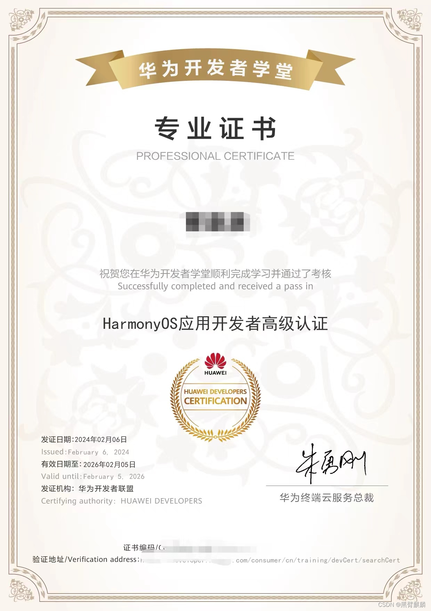

> ## 本人是一名 `大前端全栈开发老司机` & 项目经理

### 为了帮同学`少走弯路`，

> ### 我整理并归档了我**大前端全栈学习资料（书，学习笔记，面试题，教学视频）**，
>
> ### 助力你成为**大前端全栈资深工程师**，如有需要【扫码领取】

备注「大前端」

本人12年开始 &nbsp;&nbsp;&nbsp;&nbsp;做android开发，面试只回答了**view的绘制原理** 及**android事件传递机制**就成功入坑

15年 &nbsp;&nbsp;&nbsp;&nbsp;学JavaScript,React及**React Native**并应用到公司的项目中。

16年 &nbsp;&nbsp;&nbsp;&nbsp;考过了**项目管理PMP**。

17年 &nbsp;&nbsp;&nbsp;&nbsp;和前端同学一起学习并开发**微信小程序**项目。

18年 &nbsp;&nbsp;&nbsp;&nbsp;做公司的**音视频直播**及**OpenGL视频特效**功能涉及到智能指针，**音视频同步**，**直播花屏**，**智能码率**等问题。

2020年 &nbsp;&nbsp;&nbsp;&nbsp;学习了java字节码指令及**ASM字节码操作框架**、Dart、Flutter、。

2021年 &nbsp;&nbsp;&nbsp;&nbsp;学习**Compose**、使用Okhttp、Retrofit 、kotlin Flow及android Jetpack(Hilt、LifeCycle、LiveData、ViewModel、DataBinding、Room、Navigation、WorkManager、Paging3、**Media3**、Preferences、)重构android项目部分功能。

2022年 &nbsp;&nbsp;&nbsp;&nbsp;学习了CSS3、HTML5、**vue2/3**、Webpack、**Vite**、**Vant**、Element-Ui开始涉猎公司前端vue项目。

2023年 &nbsp;&nbsp;&nbsp;&nbsp;学习了TypeScript、**uni-app**及shell编程。

2024年 &nbsp;&nbsp;&nbsp;&nbsp;2月初通过了华为官方认证的鸿蒙 HarmonyOS应用开发者高级认证， &nbsp;&nbsp;&nbsp;&nbsp;目前正在持续学习`鸿蒙HarmonyOS开发`，大约今年6月份会带团队开发鸿蒙app项目

